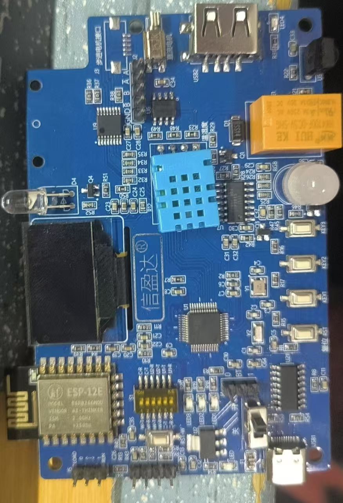
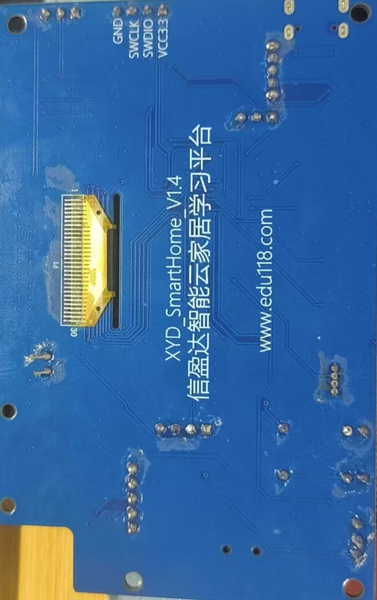

# STM32 智能家居控制系统

基于 STM32F103C8T6 的智能家居控制演示项目，使用 Keil uVision5 和 STM32F10x 标准外设库开发。系统集成 OLED 菜单界面、按键交互、LED/RGB 控制、DHT11 温湿度采集、继电器控制、直流电机 PWM 调速和时间显示页面。

本项目源于学校组织的 7 天嵌入式实训，在智能家居实训板基础上完成外设驱动调试、功能整合和演示验证。这个项目用于展示 STM32 外设驱动、模块化代码组织和多功能嵌入式系统集成能力。

## 功能

- OLED 图形菜单：支持图标切换、页面进入/退出和滑动动画
- 按键交互：通过三个按键完成菜单选择、参数调整和功能控制
- LED 控制：独立控制 3 路 LED 开关状态
- RGB 控制：调节 RGB 三通道亮度
- 温湿度采集：使用 DHT11 读取温度和湿度并在 OLED 上显示
- 风扇调速：使用 TIM3 PWM 控制直流电机速度，并显示旋转动画
- 继电器控制：模拟智能充电/开关控制场景
- 时间页面：实现基础计时、暂停和重置

## 硬件与开发环境

- MCU：STM32F103C8T6
- 开发环境：Keil uVision5
- 编译器：ARMCC V5.06
- 外设库：STM32F10x Standard Peripheral Library V3.5.0
- 显示模块：1.3 寸 OLED，SH1106/SSD1306 类 SPI 时序
- 传感器：DHT11 温湿度传感器
- 执行器：LED、RGB 灯、继电器、L9110S 直流电机驱动模块

## 项目结构

```text
.
├── User/
│   ├── Inc/                  # 用户模块头文件
│   └── Src/                  # 用户模块源码
├── STM32F10x_StdPeriph_Lib_V3.5.0/
│   └── Libraries/            # CMSIS 和 STM32 标准外设库
├── tools/                    # 字模转换等辅助脚本
├── project.uvprojx           # Keil 工程文件
├── project.uvoptx            # Keil 工程选项
└── README.md
```

## 主要源码

- `User/Src/main.c`：菜单状态机、页面显示和功能调度
- `User/Src/oled.c`：OLED 初始化、字符显示、中文显示和图片显示
- `User/Src/dht11.c`：DHT11 单总线时序读取与校验
- `User/Src/dc_motor.c`：TIM3 PWM 电机控制
- `User/Src/rgb.c`：RGB 数据发送与颜色控制
- `User/Src/relay.c`：继电器 GPIO 控制
- `User/Src/key.c`：按键扫描
- `User/Src/led.c`：LED GPIO 控制

## 编译结果

本地 Keil 构建结果：

```text
0 Error(s), 0 Warning(s)
```

## 接线说明

详细引脚表见 [docs/wiring.md](docs/wiring.md)。

## 项目展示

### 实物照片

<p>
  
  
</p>

### 演示视频

- [点击查看演示视频](docs/demo.mp4)

## 简历描述

```text
STM32 智能家居控制系统
- 在 7 天嵌入式实训期间，基于 STM32F103C8T6 智能家居实训板完成系统开发，包含 OLED 菜单界面、按键交互、LED/RGB 控制、继电器控制、DHT11 温湿度采集和直流电机 PWM 调速。
- 使用 GPIO、TIM/PWM、软件 SPI/OLED 显示、单总线传感器时序等模块，实现多页面功能切换和实时数据显示。
- 将 LED、OLED、DHT11、电机、继电器等外设模块化封装，并完成 Keil 编译验证，最终构建可交互的嵌入式演示系统。
```
